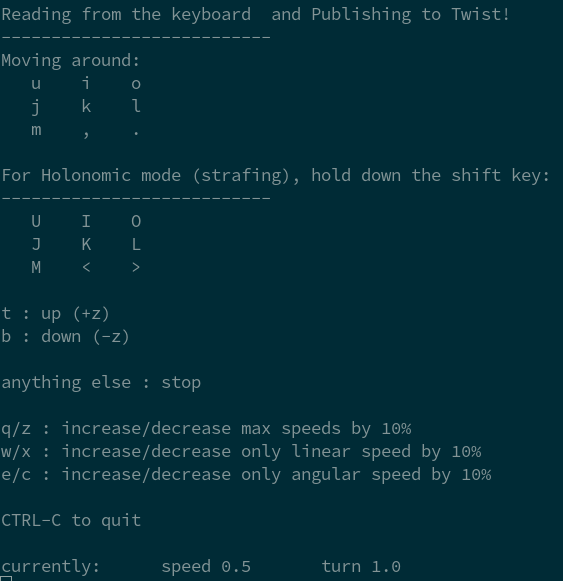

# Week 1
Welcome to Week 1 of ROS training exercises! I will first give a brief overview of what ROS is,
then we will learn the basics of ROS nodes and learn how to launch nodes.

## What is ROS?
ROS stands for Robotic Operating System. It's a very convenient framework for programming robots.

That was a short and probably not very useful explanation of what ROS is, but throughout
the coming exercises we'll learn more about what ROS is by using its core features, and
hopefully you'll gain a better understanding of what it is, but for now:

## How does ROS work?
The core of ROS deals with multiple small programs, called __nodes__, which communicate
with each other. The important thing is that each node is only responsible for one aspect
of the robot, which helps make the entire stack much cleaner.

For example, we might have a
nodes for identifying barrels, mapping, localization (finding out where the robot is) and
path planning.

## ROS Nodes and Launching Buzzsim
Before we write our own node, let's first launch an existing node. Because the ROS ecosystem
is quite large, we can easily use ROS nodes which other people have written for our own projects.

Let's start by launching the `buzzsim` simulator that we will make use of the coming few weeks:
```bash
rosrun igvc_buzzsim buzzsim
```
Here, `buzzsim` is the name of the **executable**, while `igvc_buzzsim` is the name of the
**ROS package** which the `buzzsim` executable is from.

You can think of a **ROS package** as an organizational unit under which we can put ROS nodes,
libraries, scripts and more.

After launching the node, you should see the simulator window open up:


## ROS Topics and Keyboard Teleop
Now that we've got the simulator up and running, let's try moving the turtle around. To do that, we
need to communicate to the simulator node. ROS does this through the use of **topics** and **messages**.

You can think of a ROS topic as a an address that messages are sent to, and ROS messages as the actual messages
that are sent to those topics.

For example, the simulator node listens to messages on the `/oswin/velocity` topic, makes the turtle move
depending on what message was sent. This means that we can control the turtle by sending a message on the
`/oswin/velocity` topic.

Let's try this. Open up another terminal window, and launch the `teleop_twist_keyboard` node like so:
```bash
rosrun teleop_twist_keyboard teleop_twist_keyboard.py cmd_vel:=/oswin/velocity
```

Ignore the details of the syntax for now, but this launches the `teleop_twist_keyboard` node from the
`teleop_twist_keyboard` package. You should see something like this in the terminal window:


Try pressing the keys in the image. You should see the turtle in the simulator start to move around.

What's happening is that the `teleop_twist_keyboard` node **publishes** the velocity commands to the
`/oswin/velocity` topic and because `buzzsim` node **subscribes** to the same topic, it is able to
receive those messages and move the turtle. We call the `teleop_twist_keyboard` a **ROS Publisher**
and the `buzzsim` node a **ROS Subscriber**.

## The `rostopic` tool
To look more into this, we can use the `rostopic` tool. Close the `teleop_twist_keyboard` node with
Ctrl-C, and type the following:
```bash
rostopic --help
```

The help screen of `rostopic` should show, listing out the different commands that are possible with
`rostopic`. Let's try out the `list` options:
```bash
rostopic list
```

You should see a few topics:
```
/oswin/velocity
/rosout
/rosout_agg
/tf
```

Notice that the `/oswin/velocity` topic is shown here. We can get more information about a ROS topic
with the `info` command:
```
Type: geometry_msgs/Twist

Publishers: None

Subscribers: 
 * /buzzsimsim (http://{YOUR USER NAME HERE}:36899/)
```

Here, we can see that this topic is of type `geometry_msgs/Twist`, has no `Publishers`, and has one `Subscriber`,
which is the `buzzsim` node. The type of a topic is the type of message of that topic. In this case, it is
`geometry_msgs/Twist`, which contains information about the velocity of the robot.

### `rostopic echo`
We can see exactly what is being sent on a topic with the `echo` command:
```bash
rostopic echo /oswin/velocity
```

You should see nothing being printed out: That's because nothing is being published to the this topic right now.
Let's publish something to this topic. Open up another terminal window, and open up the `teleop_twist_keyboard` node
again: 
```bash
rosrun teleop_twist_keyboard teleop_twist_keyboard.py cmd_vel:=/oswin/velocity
```

This time when you move the turtle around using the keyboard teleop, you should see the exact messages being published
in the terminal window with `rostopic echo`, something like:
```
linear:
  x: 0.5
  y: 0.0
  z: 0.0
angular:
  x: 0.0
  y: 0.0
  z: 0.0
```

### `rostopic pub`
We can also publish the messages directly from the command line also, using the `pub` command. Close the `teleop_twist_keyboard`
node again, and then run the following:
```bash
rostopic pub /oswin/velocity geometry_msgs/Twist "linear:
  x: 1.0
  y: 0.0
  z: 0.0
angular:
  x: 0.0
  y: 0.0
  z: 0.0"
```

The `rostopic pub` command will publish a message of type `geometry_msgs/Twist` to the `/oswin/velocity` topic,
and you should now see the turtle begin to move forward. To stop it, run the same command, but with a `0` for the
linear `x` velocity instead:
```bash
rostopic pub /oswin/velocity geometry_msgs/Twist "linear:
  x: 0.0
  y: 0.0
  z: 0.0
angular:
  x: 0.0
  y: 0.0
  z: 0.0"
```

Try playing around with the the `x` part of `linear` and the `z` part of `angular`, and seeing how the turtle
moves.

And that is it for week 1 of the exercises. In [week2](week2.md), we'll be looking at how to write **ROS Publishers**
and **ROS Subscribers** in C++.
