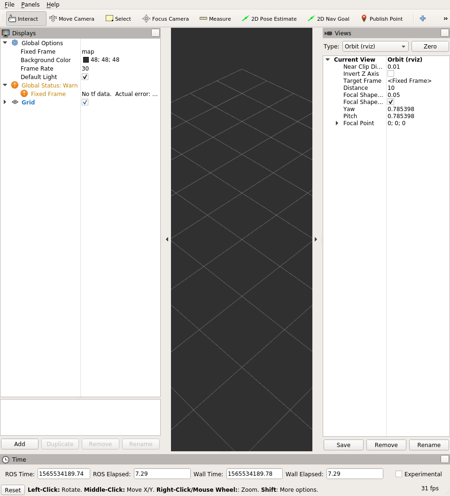

# Week 4
Welcome to Week 4 of ROS training exercises! We'll be learning about the **coordinate frames**, the **IMU**, and
**localization with dead reckoning** by integrating IMU data.

## IMU
IMU stands for Inertial Measurement Unit. A 9 DOF (degree of freedom) IMU measures accelerations, angular velocities,
and magnetic field in all 3 axis by using an accelerometer, gyroscope, and magnetometer. This means that by using an
IMU you will be able to tell your acceleration, angular velocity and heading.

## Coordinate frames and the IMU
One thing important when using the IMU is which **coordinate frame** the data is in. A **coordinate frame** is a
refers to the coordinate system that is used for the data. For example, the IMU can measure accelerations in the
x, y and z axes in the _robot's coordinate frame_, which is different from the _world's coordinate frame_.

A quick note: ROS has a [REP 103](https://www.ros.org/reps/rep-0103.html) which defines conventions for coordinate
frames. In particular, for bodies, X points forward, Y points left, and Z is pointing up, while for geographic
locations X points east, Y points north, and Z points up.

An easy way to understand this is through an example:
Let's say my IMU is mounted in the same direction as my robot. This means that when my IMU records an acceleration in
the X direction, it means that the robot has accelerated forwards in the +X direction.
However, let's say that my robot is located at the point (1,1) in the world and is pointed north. In the
_robot's coordinate frame_, the acceleration is in the +X direction. However, in the _world's coordinate frame_, because
the robot is pointed north, which corresponds to the +Y direction, the acceleration is in the +Y direction.

## Localization with dead reckoning
We can perform localization with an IMU, to find out where we are. The simplest form of localization is called
*dead reckoning*, where you determine your position by taking your previous position integrating your velocity over the
elapsed time. In the case of our IMU though, since we get _linear accelerations_ instead of _linear velocities_, we will
need to integrate twice, and keep track of our velocities.

This means that our **state**, the things we need to keep track of, consists 4 things: Our x, y, heading and x-velocity.

Whenever a new IMU measurement comes, we can update our **state** using the basic Physics kinematics equations:

<p align="center">
    
</p>

There are many ways of numerically integrating the data that yield more accurate results, this is just one simple
way.

By doing this, we should be able to keep track of our position.

### Exercise: Implementing dead reckoning using an IMU in ROS
Let's try implementing dead reckoning in ROS with the simulation environment. Launch the environment with `roslaunch`:
```bash
roslaunch igvc_training_exercises week4.launch
```

You should see just a single turtle in the middle:


However, if you look at the rostopics, you'll see that there's now an imu topic `/oswin/imu` of type `sensor_msgs/Imu`.
Also, you can see that `/oswin/ground_truth` isn't there. We'll need to use dead reckoning to compute an estimate
of our pose.

Open up `rqt_plot` and graph the accelerations in the x axis, and then open up teleop_twist_keyboard as before:
```bash
rosrun teleop_twist_keyboard teleop_twist_keyboard.py cmd_vel:=/oswin/velocity
```

Move around a bit and get a feel for what the accelerations from the IMU look like as you move around.

After you get a feel of what kind of data you're working with, its time to start writing some code. We'll be
implementing this node in [week4/main.cpp](../igvc_training_exercises/src/week4/main.cpp).

First thing to do tis to write a subscriber that subscribes to the `/oswin/imu` topic. You should be familiar by now with
how to do this. `ROS_INFO_STREAM` the x acceleration and then run it to make sure that everything is working properly.

Afterwards, it's time to begin writing the actual dead reckoning. Before we start with implementing the
kinematics equations earlier though, we need to setup the global variables representing our robot state that we'll
need to keep track of in between callbacks. In addition, we'll need to keep track of the time which we received the last
message in order to calculate the time in between each callback.

Afterwards, we can start implementing the dead reckoning algorithm in the callback. Here are the equations again, so
that you don't need to scroll back up and find them:

<p align="center">
    
</p>

Now that we have some basic localization, we need to publish this information so that we can visualize it, and so that
other nodes are able to use this information. ROS provides the `nav_msgs::Odometry` message type that describes the
robot's current location.

Create a publisher for the message type `nav_msgs::Odometry` on the topic `/oswin/odometry`, and then publish the
results of your dead reckoning. As always, don't forget to `#include` the message type.
If you forget Clion should yell at you as always.

#### Representing orientations: euler angles and quaternions
When you get to filling in the `nav_msgs::Odometry` message, you'll notice that `msg.pose.pose.orientation` has four
different fields: `x`, `y`, `z` and `w`.

This is because the `orientation` field using something called **quaternions**, which uses a 4D
vector to represent orientations in 3D space. If you're interested in the math of how quaternions work, feel free to
google them. There's also a neat [video](https://www.youtube.com/watch?v=zjMuIxRvygQ) by 3Blue1Brown that explains it.

Don't worry if you don't understand how they work though. We can work with another representation of orientations called
**euler angles** which are much simpler to understand and work with. The euler angles representation uses three numbers
represent orientations: **roll**, **pitch** and **yaw**. If you're familiar with airplanes then this should be familiar
to you: **roll** represents rotation around the **x** axis, **pitch** represents rotation around the **y** axis, and
**yaw** represents rotation around the **z** axis.


<p align="center">
    
</p>

Because we're working in 2D, **roll** and **pitch** are 0, so the only angle we need to worry about is **yaw**.

#### Converting between euler angles and quaternions
In order to convert between euler angles and quaternions, the ROS built-in `tf` package provides a few useful methods
that we can use.

Add the following `#include`:
```c++
#include <tf/transform_datatypes.h>
```

We can then use the `tf::createQuaternionMsgFromYaw` message to convert from yaw to a quaternion. This might look
something like:
```c++
odometry_msg.pose.pose.orientation = tf::createQuaternionMsgFromYaw(g_heading);
```

#### The `Header` message type
One important field that we haven't gone over yet is the `Header` field on `nav_msgs::Odometry`. If you look at the
clion auto-correct, you should see two fields inside the `Header` message type: `stamp` and `frame_id`.

`stamp` refers to the timestamp of the message. `frame_id` on the other hand refers to the name of the
**coordinate frame** of the message. If you recall at the beginning when we talked about coordinate frames, the
x acceleration is different depending on which coordinate frame you're talking about. In order to be clear about which
**coordinate frame** we're talking about, we can use this `frame_id` field to refer to a specific coordinate frame.


ROS defines a few standard coordinate frame names in  [REP 105](https://www.ros.org/reps/rep-0105.html). Of those, we
will be using the `odom` frame, which is a world-fixed frame.

To do this, set the `frame_id` to equal `"odom"`.

#### Visualizing our localization algorithm with `rviz`
We're finished with the algorithm, but we have no idea how well it works. To visualize the `nav_msgs::Odometry` message
we're publishing, we can use the `rviz` tool which ROS provides for visualizing the robot and other informations.

Open up rviz by running the `rviz` command:
```bash
rviz
```

You should see something similar to the screen below:


In order to visualize the `nav_msgs::Odometry` message that we're publishing:
1. On the left in the `Global Options` section change the `Fixed Frame` to "odom", the value of the `frame_id` we set
earlier.
2. On the right, in the `Views` section, change the `Type` to `TopDownOrtho` to change the view from 3D to top down 2D.
3. Click the `Add` button on the bottom left, select the `By topic` tab, and click `Odometry` under `/oswin/odometry`.
You should now see a red arrow in the middle of your screen visualizing the `nav_msgs::Odometry` message that you're
publishing.

Try moving the robot again using `teleop_twist_keyboard`. You should notice both the turtle in the simulator and the
red arrow moving, and hopefully the red arrows will be in the same location as the turtle in the simulator.
