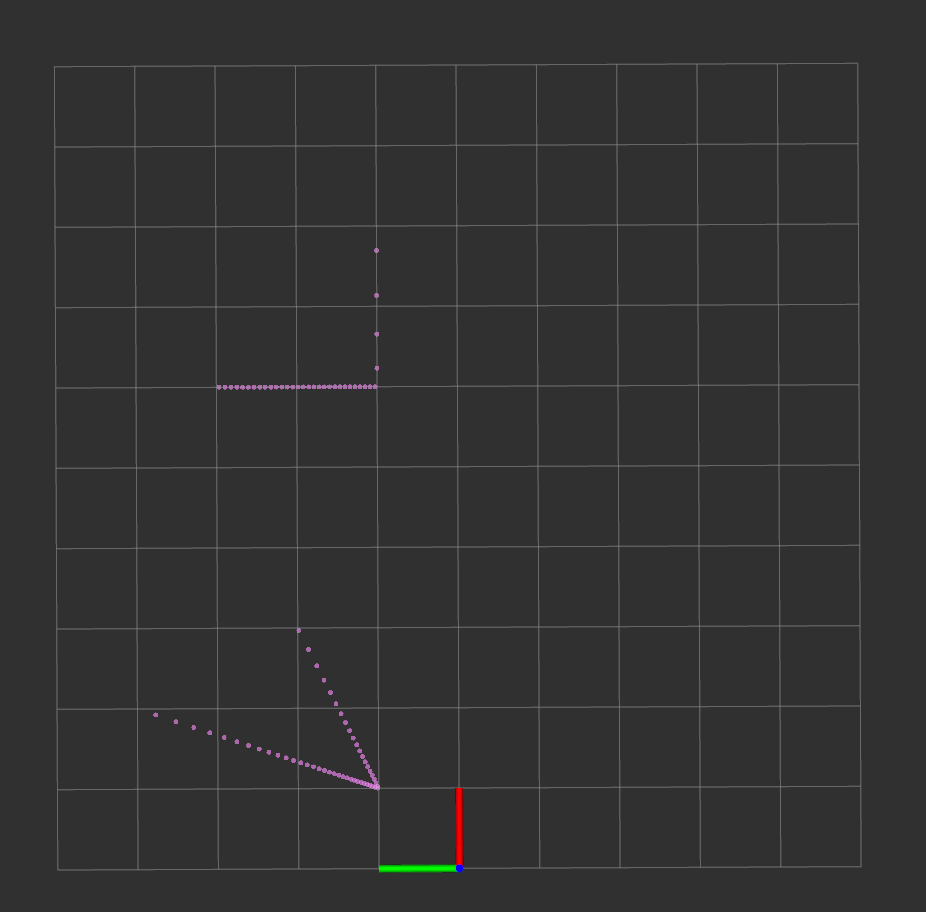
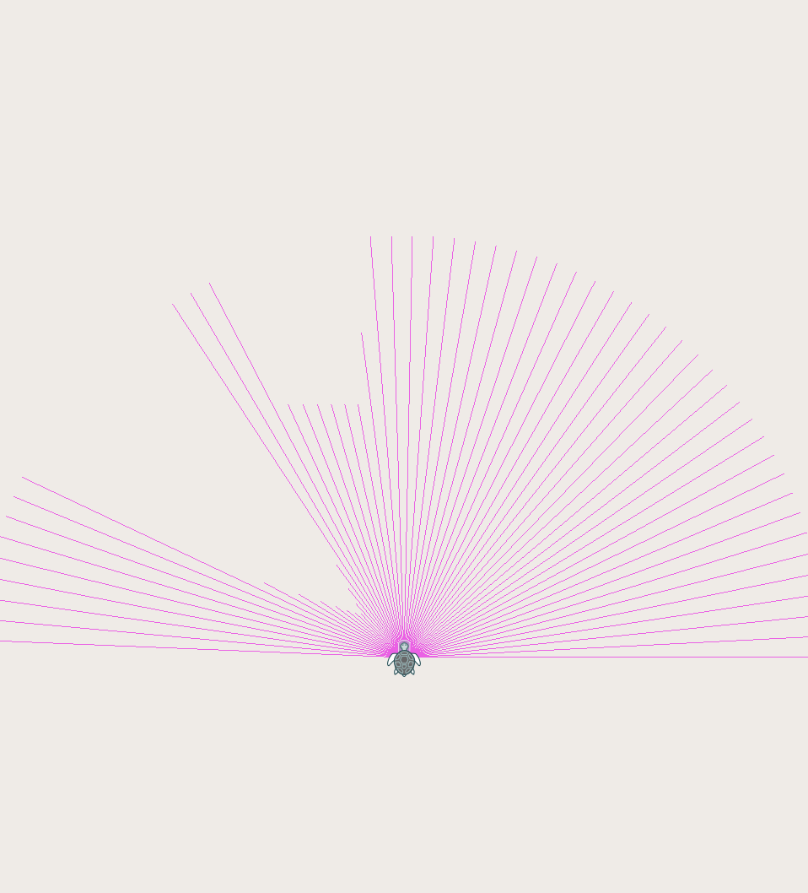
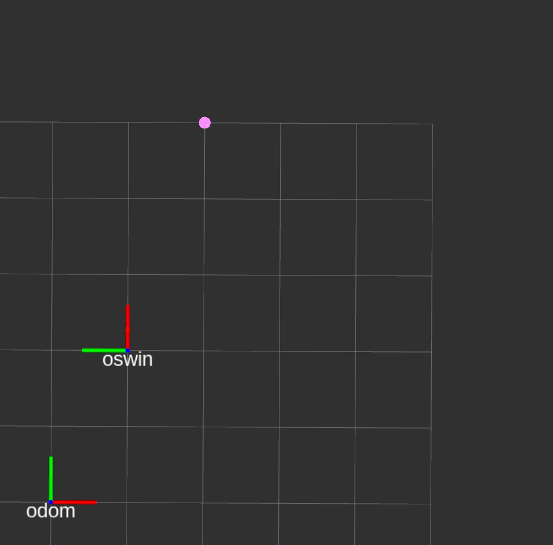
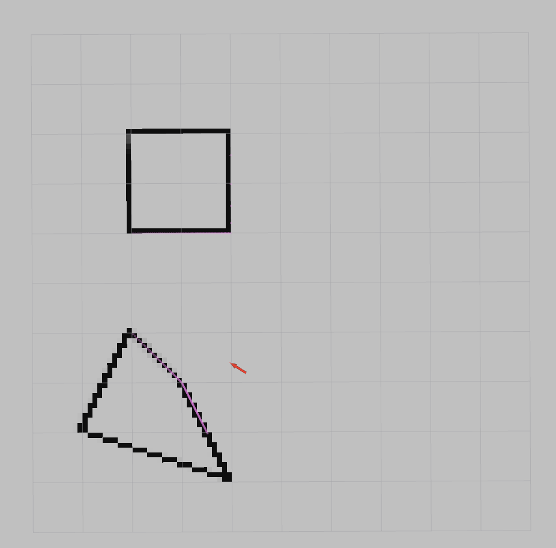

# Week 5
Welcome to Week 5 of ROS training exercises! We'll be learning about the **lidar**, **mapping**, and
**occupancy grid maps** using lidar data.

## Lidar
**Lidar**, which stands for **Li**ght **D**etection **a**nd **R**anging, is a method of measuring distances to a target
by shooting a _laser_ and measuring the reflected light. The distance can be obtained by measuring the
**time of flight** of the laser beam and using the speed of light.

In the context of _robotics_, a lidar is most often used to take distance measurements around the robot, so that the
robot can "see" around it, whether this is in _2D_ or _3D_. An example lidar measurement from the simulation is below:

Lidar visualization in rviz |  Lidar visualization in simulation
:--------------------------:|:-------------------------:
         |  

Notice that we are able to "see" the surrounding obstacles from the "shape" of the lidar scan. We can use this
to construct a map of our surroundings.

## Playing with lidar in the simualation with rviz and keyboard teleop
Let's get a feel for what lidar data is like. Launch `week5.launch`:
```bash
roslaunch week5.launch
```

The simulation should pop up with a lidar visualization like the above image. Next, open up rviz:
```bash
rviz
```

This time, change the **fixed frame** in the top left corner of the left menu to `oswin` instead of `odom`, and then
set the **target frame** in the right menu to `oswin` as well.

In addition, add the "PointCloud2" visualization so you can visualize the lidar data by clicking **add** in the left
menu and clicking "PointCloud2", then changing the "Topic" to `/oswin/pointcloud`.

In a third window, open up `teleop_twist_keyboard` as you have done many times already:
```bash
rosrun teleop_twist_keyboard teleop_twist_keyboard.py cmd_vel:=/oswin/velocity
```

Feel free to mess around a bit, getting a feel for what kind of data the lidar scans give us. While the simulation
shows us a "global" view of whats going on, the view in rviz shows us what the lidar is actually seeing.

After moving around a bit, revert the **fixed frame** and **target frame** settings to `odom` instead of `oswin` as it
will be more useful to visualize data this way.

## Grid Maps
How do you do mapping? One way is through the use of **grid maps**. As the name suggests, a _grid map_ uses a _grid_
to represent the world. The locations of any obstacles are then **discretized** into the grid cells.

For example, if I had a map with a _dimension_ of 5m x 10m, a _resolution_ of 10cm per grid cell, and (0, 0) in the map
corresponds to (0m, 0m) in the real world. Then I would have a total of (5m * 10 cells/m) * (10m * 10 cells/m) = 5000
grid cells.

Let's say that there was an obstacle (let's assume it's a single point) located at coordinates (2m, 7m).
This would translate to the coordinates (2m * 10 cells/m, 7 * 10 cells/m) = (20, 70) on the grid.

Suppose there's another obstacle (also a single point) located at coordinates (2.01m, 7.01m). What grid coordinates
would that translate to?
[Hint](#spoiler 'Because we can only have a whole number of grid cells, you need to round your answer')
[Answer](#spoiler 'It will also be located at (20, 70).')

This is one of the cons of using grid maps. Because real world, continuous coordinates are **discretized** into
grid coordinates, we end up with some discretization error, depending on the resolution of your map.

However, one pro of grid maps is that they are **easy** to work with in terms of **mapping** as well as
**path planning**, which we will get into next week.

## Coordinate Frames (_again_) with mapping and lidar
Before we start implementing a grid map, we need to look at coordinate frames again.

Data from the lidar is obtained _relative to the sensor position_. However, we want this data in the **global**
coordinate frame, one of which is the "odom" frame according to ROS conventions outlined in
[REP 105](https://www.ros.org/reps/rep-0105.html). We thus need to transform these coordinates from the sensor's
_coordinate frame_ to the "odom" frame. What does this look like?

Assume our robot is at the coordinates (1,2) facing 90 degrees (Remember in ROS for world frames x points East and 
y points North, with 0 degrees yaw being East and increasing Counterclockwise). A lidar mounted on our robot at the
same location sees an object at coordinates (3, -1) in the **robot**'s frame
(In ROS for body frames x points forward and y points left). What are the coordinates of (3, -1) in the **odom** frame?


Looking at the image above, you can see that (3, -1) in the odom frame has the coordinates of (2, 5)
(Red is the x-axis, Green is the y-axis).

Once we have transformed this lidar point into the **odom** frame, we can then insert this point into our map and mark
it as occupied. To do mapping, we just need to repeat this procedure for every point in the lidar scan everytime we get
a lidar scan.

## Obtaining the coordinate transform and transforming pointclouds in C++
Now that we know why we need to transform the lidar scans, let's find out how we can do this.

There are multiple ways of obtaining the transforms. One way we can get the transform is by looking it up using **tf**,
a useful package that makes coordinate transforms easy in ROS.
 
### Coordinate transforms with `tf::TransformListener`
To obtain a coordinate transform using `tf`, we need to use something called a `tf::TransformListener`. As the name
suggests, this class "listens" for coordinate transforms between different reference frames. If you remember
`tf::TransformBroadcaster` from last week, all `tf::TransformListener` does is just listen for the transforms which are
broadcasted by the `tf::TransformBroadcaster` in other nodes. We don't need to worry about the
`tf::TransformBroadcaster` part this week as the simulation already takes care of that for us.

To use a `tf::TransformListener`, first create one like so:
```c++
tf::TransformListener listener;
```

Then, to use it to lookup transforms, say from the frame "oswin" to the frame "odom", do the following:
```c++
tf::StampedTransform transform;
try {
  listener.lookupTransform("odom", "oswin", ros::Time(0), transform);
} catch (tf::TransformException &ex) {
  ROS_ERROR_STREAM(ex.what());
}
```

The `ros::Time(0)` argument specifies the timestamp of the transform which we are trying to lookup. In this instance,
`ros::Time(0)` signifies that we want the latest transform.

Notice that we use a `try { ... } catch () { ... }` statement here. This is because `listener.lookupTransform()` might
**throw** an **exception** if some error occurs, eg. it is unable to find the transform requested. If we don't add a
`try { ... } catch() { .. }` here, then the program will crash when an error occurs. By adding a `try catch` we can
"catch" the exception and perform any error handling without crashing the entire program.

### `tf::Transform` and `tf::StampedTransform`
Now, what is this `tf::StampedTransform` that we created? Using clion's autocomplete, you should be able to see that it
has a `header` member of type `Header` and a `transform` member of type `tf::Transform`.

The `header` part should be
familiar to you - you've used it last week when dealing with coordinate transforms.

The `transform` part is new - it's of type `tf::Transform`, which is what the `tf` library uses to represent
transformations between coordinate frames. We won't need to know too much about how `tf::Transform` works right now,
but using clion again and looking at autocomplete two methods that will be useful are `getOrigin()` which returns a 
`tf::Vector3` representing the **translation** part of transformations, and `getRotation()` which returns a
`tf::Quaternion` representing the **rotation** part.

### Transforming Pointclouds with `tf::Transform`
Now it's time to actually transform a Pointcloud with this `tf::Transform`.

First off though, what type is a Pointcloud?

The details are kind of confusing for ROS as there have been a few versions and things, but we'll use the type
**`pcl::PointCloud<pcl::PointXYZ>`**. Notice that `pcl::PointCloud` is a template as we use angle brackets, just as we
do with `std::vector`. Don't worry about the template part of this though, as we'll only ever be using
`pcl::PointCloud` with `pcl::PointXYZ`.

To transform a pointcloud, we can make use of a function from `pcl_ros`:
```c++
pcl::PointCloud<pcl::PointXYZ> transformed_cloud;
pcl_ros::transformPointCloud(input_cloud, transformed_cloud, transform);
```

where `input_cloud` is the pointcloud you want to transform, and transform is the `tf::Transform` representing the
transformation that you want to do.

### The actual map data type
And before we forget, we need to store the map information somewhere. One data type that can be easily visualized in
rviz (we're all about good visualization) is `nav_msgs::OccupancyGrid`.

Some important points:
* The `info` member contains information about the map: width, height etc. Check
[here](http://docs.ros.org/melodic/api/nav_msgs/html/msg/OccupancyGrid.html) (You can find this by googling
nav_msgs::OccupancyGrid) for more information.
* The `data` member (of type `std::vector<int8_t>` needs to be initialized. In `main` before you call `ros::spin()` make
sure that the `data` member is initialized to have as many elements as there are grid cells, ie.
```c++
map.data = std::vector<int8_t>(total_cells, 0);
```
* The map is 2D, but the `data` member is only 1D. This means that you'll need to convert from 2D coordinates to an
index.
  * This works by imagining an index that increments left to right, top to bottom. For example, for a 3x3 grid:
 
 0 1 2
 
 3 4 5
 
 6 7 8

## Implementing a simple mapping in ROS with C++
Now you know everything you need to implement a simple mapper for lidar points in ROS. Write your node in
[src/week5/main.cpp](../igvc_training_exercises/src/week5/main.cpp).

For this mapper, we'll increment the occupied grid cell by 1 every time, until it reaches 100 (Since thats the maximum
value. See [here](http://docs.ros.org/melodic/api/nav_msgs/html/msg/OccupancyGrid.html)
(Again google gets you this link))

1. Subscribe to `/oswin/pointcloud` and write a callback function taking in `pcl::PointCloud<pcl::PointXYZ>`
2. Create a global `tf::TransformListener` and call `lookupTransform` from `oswin` to `odom` inside the callback
3. Transform the pointcloud from the `oswin` frame to the `odom` frame using `pcl_ros::transformPointCloud`
4. Iterate through the pointcloud. For each point, find which grid cell it is, then increment that cell by 1 if its
less than 100
5. Create a publisher of type `nav_msgs::OccupancyGrid` and publish the map

If you've implemented it correctly, if you open up rviz and add the `nav_msgs::OccupancyGrid` visualization, you should
see a map that gets populated with obstacles as you drive around in the simulation with `teleop_twist_keyboard`.


## Extensions:
<details>
  <summary>1. <bold>Occupancy</bold> grid mapping </summary>
  
  While we've implemented grid mapping (this was how mapping was done in IGVC during 2017-2018, can you believe that?),
  incrementing a variable by one every time you see a cell being occupied isn't exactly mathematically rigorous
  in terms of the information we're getting from the lidar scan.
  
  The mathematically proper way to do grid mapping is something called **occupancy grid mapping**. This adds to grid
  mapping the idea that each cell in the grid is a **binary bayes filter** for the **probability** that a certain cell
  is occupied.
  
  What this means is that each grid cell has a probability of being occupied or not, and as we gain more information
  about the whether the grid cell is occupied or not we used
  [**Bayes' Theorem**](https://en.wikipedia.org/wiki/Bayes%27_theorem). If you haven't encountered Bayes' Theorem
  before, it is a formula for the **conditional probability** based on the reverse _conditional probability_ and
  the _marginal probabilities_ for each variable.
  
  This was probably still pretty vague. You can check out
  [this presentation](http://ais.informatik.uni-freiburg.de/teaching/ws13/mapping/pdf/slam10-gridmaps.pdf)
  for a nice derivation of the math of occupancy grid mapping and binary bayes filter, which I won't go into here.
  Basically, mathematically our problem can be phrased as finding:
  
  <p align="center">
     
  </p>
  where:
  <ul>
    <li> represents the probability
    that the i<sup>th</sup> cell of the map is occupied.
    <li> represents all the
    sensor data collected from time 1 (the beginning) to time t (the current time)</li>
    <li> represents the all the
    robot's poses from time 1 (the beginning) to time t (the current time)</li>
  </ul>
  
  This can be understood as saying "what is the probability that cell i of the occupancy grid is occupied using
  the sensor data and location of the pose of my robot from the beginning of time till now".
  
  After using Bayes' Theorem and the Markov Theorem and some other tricks, we end up with the following:
  
  <p align="center">
    
  </p>
  
  where we have on the left
  
  , which is what we're trying to find, divided by 1 - the previous term, equal to a product of three terms:
  
  <ul>
    <li>
        The first term is the probability that a given cell is occupied divided by the probability it isn't occupied
        using data <b>from the beginning till time t</b>.
    </li>
    <li>
        The second term is the probability that a given cell is occupied divided by the probability it isn't occupied
        using data <b>from the beginning till time t - 1</b> (This is the recursive part, so the output one timestep ago)
    </li>
    <li>
        The third term is the probability that a given cell is occupied divided by the probability it isn't occupied
        without using any sensor or pose data. So this represents <b>prior</b> knowledge we know about the occupancy.
    </li>
  </ul>
  
  We can simplify this even further by defining something called the **log odds notation**, which is defined as
  <p align="center">
    
  </p>
  
  This simplifies the above expression, turning multiplications (which are more expensive) into sums (which are cheap):
 
  <p align="center">
    
  </p>
  
  or in short:
  <p align="center">
    
  </p>
  
  Let's go through an example to demonstrate how this works:
  
  Assume that we're trying to map some unknown environment, and we have perfect knowledge of where we are, and we also
  periodically receive sensor data from a lidar scan to tell us where obstacles are and aren't.
  
  We don't know anything about the map yet, so we have **no prior**, and so the probability for every grid cell on the
  map is 0.5: it's as likely to be _occupied_ as it is to be _empty_. Because we want to be computationally efficient,
  we choose to represent probabilities using **log odds notation**, so instead of storing a 0.5 for each grid cell,
  we store the value:
  <p align="center">
     
  </p>
  
  Now, let's say that we know that we are at (0, 0), it's currently time t=1 (we just started), and our lidar scan
  tells us that there's there's an obstacle at (1, 1). With the new information, what's probability that
  grid cell (1, 1) is occupied?
  
  Let's use the formula from earlier to calculate the new probability for the grid cell (1, 1). We don't know anything
  about the map, and so our **prior**,
  
  
  Since this is the first time we received sensor data, the current lidar scan is
  ,
  and there is no .
  Thus,
  .
  
  And finally, there's the
   
  , or
     
  term.
  
  This term represents the probability that the map cell is occupied if we **only** had access to the currernt pose and
  sensor information. In this case, this depends on how accurate our sensor is: "What's the probability that my sensor
  is correct if it's telling me that there's obstacle at some location?".
  
  Let's assume that there's a 0.95 probability that there really is an obstacle when the lidar says there's an obstacle.
  In this case, taking the log odds of 0.95,
   
  the final probability that map cell (1, 1) is occupied is:
  <p align="center">
     
  </p>
  which, when converting back to normal probability, is just 0.95 - we only have one reading from our sensor which has
  a 0.95 probability of being correct.
 
  Now, moving on to the next timestep at t=2. We get another lidar scan telling us that cell (1, 1) is occupied. Our
  **prior** is still the same - we don't know anything intrinsically about whether or not the environment is occupied
  or not. However, the
   
  term is now different. We do have an estimate of the probability of cell (1, 1) being occupied at time t=1, which is:
  <p align="center">
     
  </p>
  
  Now for the
  
  term. Our lidar is still detecting an obstacle at (1, 1), and the probability that our lidar is correct is still 0.95,
  so this is exactly the same value as time t=1:
  <p align="center">
     
  </p>
  
  Summing together the terms for time t=2:
  <p align="center">
     
  </p>
  which when converting back to normal probability is:
  <p align="center">
     
  </p>
  
  Notice something interesting here: while our first lidar scan changed the probability from 0.5 to 0.95 (an increase
  of 0.4), the second lidar scan only changed the probability from 0.95 to 0.99 (an increase of 0.04). This is because
  the first lidar scan gave us more information than the second lidar scan.
  
  One way of understanding how this works is by taking this to the extreme, and instead of comparing the first and
  second laser scan, to compare the first and the 1000th laser scan: If you have already had 999 laser scans that told
  you that cell (1, 1) was already occupied, then the 1000th laser scan basically tells you nothing new. You already
  knew that cell (1, 1) was occupied, and hearing it for the 1000th time adds nothing. On the other hand, if you don't
  know anything about whether cell (1, 1) was occupied or not, and then suddenly you learn from a somewhat reliable
  source that cell (1, 1) **is** occupied, then you've got from having a belief that the probability is 0.5 to however
  much you trust that source of information.
  
  This is why naiively counting doesn't work: it doesn't take into account the fact that the amount of information
  gained changes depending on what you already know. With the old mapping method, the first scan is equally as valuable
  as the 1000th scan, even though clearly that isn't the case.
  
  Now that you understand occupancy grid mapping a little bit more, let's change the current algorithm to use this.
  You will need to make your own map that uses `double` (to make things easier), which you can do by creating a
  global `std::vector<double>` variable to act as a map.
  
  [Hint](#spoiler "First create the std::vector<double> map, and set everything to 0 (no prior)")
  [Hint](#spoiler "Next, create methods to convert to and from log odds, using the equations earlier")
  [Hint](#spoiler "Finally, instead of increasing the cell by 1, create a parameter 'lidar_hit_probability'
  to represent the probability that the lidar scans are accurate, and then instead
  change the cell's value by the log odds of that probability.")
  
  Note: To display your map, you will need to convert from log odds back to normal probabilities. Scale the probability
  from 0-1 to 0-100, and you should be good to go!
</details>

# Summary
And that's it for this week!

We learnt about:
- [The LiDAR](#lidar)
    + Takes distance measurements around the robot
    + Allows the robot to "see" obstacles
- [Grid Maps](#grid-maps)
    + A grid map discretizes the world into cells
    + Easy to implement and use, but may have discretization errors
- [Coordinate Frames and Transforms](#coordinate-frames-_again_-with-mapping-and-lidar)
    + The coordinate of objects in different coordinate frames is different
    + We can use transforms to transform the coordinates of an object from one frame to another
- [Transforming Pointclouds in ROS](#transforming-pointclouds-with-tftransform)
    + Use the `pcl_ros::transformPointCloud` function to transform pointclouds to a different coordinate frame
- [Implementing a simple mapper](#implementing-a-simple-mapping-in-ros-with-c)
    + Getting practice with working with pointclouds and performing coordinate transforms
